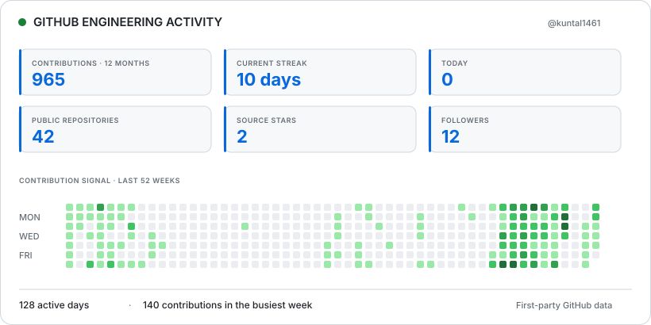
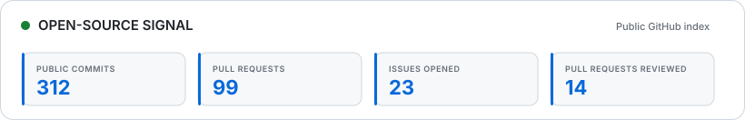

# Kuntal Maity

### Backend Engineer · Java · Spring Boot · API-Driven Systems

## Profile Summary

I am a backend software engineer at **Tata Business Hub**, building production-grade systems with Java, Spring Boot, and SQL. My work centers on API-driven architecture, backend services, database engineering, and third-party integrations that support real business workflows. I design REST APIs and distributed workflows with clear contracts, deliberate failure handling, and maintainable service boundaries. My cloud exposure includes AWS Textract, OCR-based document processing, AI pipelines, and automation across Microsoft Power Automate and Teams. I focus on performance optimization, reliability, and the operational details that keep scalable production systems predictable. I am most effective when a problem crosses application code, data, framework internals, and system integration boundaries.

## Technical Skills

- **Languages:** Java, Python, JavaScript, SQL
- **Backend & Frameworks:** Spring Boot, Spring MVC, Hibernate/JPA, REST APIs, Maven, Spring AOP
- **Databases:** MySQL, PostgreSQL
- **Search & Messaging:** Elasticsearch, Apache Kafka
- **Cloud & AI:** AWS Textract, AI Pipelines, OCR-based Document Processing, Microsoft Power Automate
- **Architecture & Integration:** JSON Processing, Third-party API Integration, Microsoft Teams Integration
- **Testing & Tools:** JUnit, Postman, JIRA
- **Version Control:** Git, SVN

## Engineering Focus

| Backend systems | APIs and integrations | Data and reliability |
|---|---|---|
| Production services, distributed workflows, concurrency safety | Contract design, validation, third-party APIs, backward compatibility | Relational modeling, messaging, observability, performance analysis |

## Live GitHub Activity

<picture>
  <source media="(prefers-color-scheme: dark)" srcset="./assets/github-dashboard-dark.svg">
  <source media="(prefers-color-scheme: light)" srcset="./assets/github-dashboard-light.svg">
  
</picture>

Rolling 12-month data generated directly from GitHub every day at 12:00 PM IST.

### Recent Activity

<!-- recent_activity:start -->
- `2026-10-02` · Opened pull request in [apify/apify-cli](https://github.com/apify/apify-cli)
- `2026-10-02` · Created branch in [kuntal1461/apify-cli](https://github.com/kuntal1461/apify-cli)
- `2026-10-02` · Pushed commit in [kuntal1461/apify-cli](https://github.com/kuntal1461/apify-cli)
- `2026-09-30` · Pushed 2 commits in [kuntal1461/kuntal1461](https://github.com/kuntal1461/kuntal1461)
<!-- recent_activity:end -->

## Open-Source Impact

I maintain [HavocFlow](https://github.com/havocflow/chaos-spring-boot-starter), an annotation-driven chaos-engineering library for Spring Boot with WebFlux, Kafka, OpenTelemetry, and Gateway integrations. My upstream work includes Swagger Core dependency management and schema fixes, Spring AI tool-calling and session-memory corrections, OpenAI Java deserialization, and production fixes across Java and Go services. I keep contributions narrow, test-backed, and explicit about the failure mode they address.

<picture>
  <source media="(prefers-color-scheme: dark)" srcset="./assets/open-source-impact-dark.svg">
  <source media="(prefers-color-scheme: light)" srcset="./assets/open-source-impact-light.svg">
  
</picture>

| Project | Selected engineering contribution |
|---|---|
| [swagger-api/swagger-core](https://github.com/swagger-api/swagger-core/pulls?q=is%3Apr+author%3Akuntal1461) | Maven BOM, validation meta-annotation processing, and Java time-format support |
| [spring-projects/spring-ai](https://github.com/spring-projects/spring-ai/pulls?q=is%3Apr+author%3Akuntal1461) | Tool-context validation, evaluator feedback handling, and test clarity |
| [spring-ai-community/spring-ai-session](https://github.com/spring-ai-community/spring-ai-session/pull/19) | Prevented invalid empty assistant frames during AWS Bedrock tool-call replay |
| [openai/openai-java](https://github.com/openai/openai-java/pull/771) | Added robust numeric-string deserialization for organization cost responses |
| [apify/apify-cli](https://github.com/apify/apify-cli/pulls?q=is%3Apr+author%3Akuntal1461) | CLI validation and JSON-input fixes with regression coverage |
