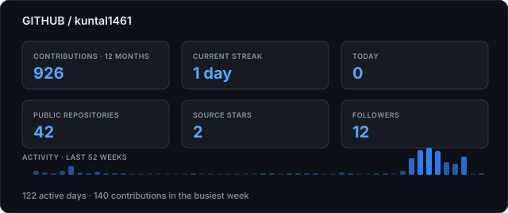

# Kuntal Maity

### Backend Engineer · Java · Spring Boot · Distributed Systems

## Profile Summary

I am a backend engineer at **Tata Business Hub**, building production services with Java and Spring Boot. I design REST APIs, service integrations, and data flows that stay predictable under real traffic. My work spans distributed systems, asynchronous processing, relational data, and cloud-native delivery. I care about API contracts, failure semantics, observability, and operational simplicity. I trace difficult defects from symptoms to the library or concurrency boundary that caused them. I use tests as executable design constraints, especially around edge cases and regressions. I am comfortable moving between application code, framework internals, databases, and build pipelines. Outside product work, I maintain **HavocFlow**, an annotation-driven chaos-engineering starter for Spring Boot. I also contribute focused fixes to Spring AI, Swagger Core, OpenAI Java, Apify CLI, and Go services. I enjoy turning ambiguous production problems into small, reviewable, durable changes.

## Technology Stack

`Java` · `Spring Boot` · `Spring WebFlux` · `Kotlin` · `Go` · `Python` · `REST / OpenAPI` · `Kafka` · `PostgreSQL` · `MySQL` · `Elasticsearch` · `Docker` · `Maven` · `GitHub Actions` · `OpenTelemetry`

## Engineering Focus

| Area | What I optimize for |
|---|---|
| Backend systems | Clear service boundaries, resilient workflows, concurrency safety, and measurable behavior |
| APIs & integrations | Stable contracts, explicit validation, useful errors, and backward-compatible change |
| Data & messaging | Deliberate schemas, transaction boundaries, idempotency, caching, and event-driven processing |
| Reliability | Failure injection, regression tests, dependency hygiene, telemetry, and production diagnosis |

## Live GitHub Activity

> Generated from the GitHub API every day at 12:00 PM IST; values are never maintained by hand.

## Open-Source Impact

I maintain [HavocFlow](https://github.com/havocflow/chaos-spring-boot-starter), a Spring Boot chaos-engineering library with WebFlux, Kafka, OpenTelemetry, and Gateway integrations published to Maven Central. My upstream work includes a Swagger Core Maven BOM, validation and schema-resolution fixes, Spring AI tool-calling and session-memory corrections, and production bug fixes across Java and Go projects. I favor narrow patches backed by regression tests, clear failure analysis, and maintainable API behavior.

| Project | Selected engineering contribution |
|---|---|
| [swagger-api/swagger-core](https://github.com/swagger-api/swagger-core/pulls?q=is%3Apr+author%3Akuntal1461) | Maven BOM, validation meta-annotation processing, and Java time-format support |
| [spring-projects/spring-ai](https://github.com/spring-projects/spring-ai/pulls?q=is%3Apr+author%3Akuntal1461) | Tool context validation, evaluator feedback handling, and test clarity |
| [spring-ai-community/spring-ai-session](https://github.com/spring-ai-community/spring-ai-session/pull/19) | Prevented invalid empty assistant frames during AWS Bedrock tool-call replay |
| [openai/openai-java](https://github.com/openai/openai-java/pull/771) | Added robust numeric-string deserialization for organization cost responses |
| [apify/apify-cli](https://github.com/apify/apify-cli/pulls?q=is%3Apr+author%3Akuntal1461) | CLI validation and JSON-input fixes with regression coverage |

Build reliable systems. Diagnose the awkward edge cases. Leave the codebase easier to operate.

